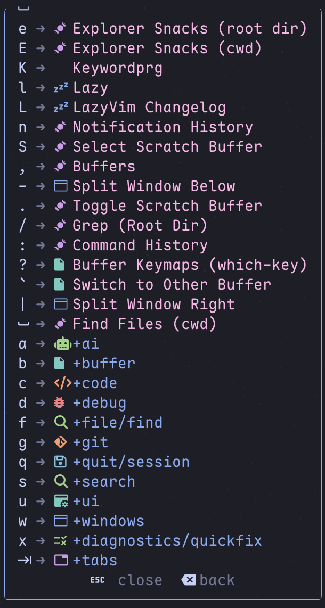

这一页列出的快捷键，默认都指的是这套 `LongwayBai/lazyvim-config` 里的实际行为。

如果你刚开始用，不要想着一次把所有键位背完。LazyVim 真正好用的地方，反而是你只记住最常用的那一小部分，也已经能把日常工作串起来了。

## 先理解 Leader 键

:::tip[理解 Leader 键]
在 Neovim 里，很多操作都不是直接按一个组合键完成，而是先按一个"入口键"，再按后面的按键。这个入口键就叫 **Leader 键**。
:::

在 Neovim 里，很多操作都不是直接按一个组合键完成，而是先按一个"入口键"，再按后面的按键。这个入口键就叫 **Leader 键**。

这套配置里，Leader 键是：**空格 (Space)**。

*图：按下空格后，底部会弹出快捷键分组提示。你看这张图时，重点可以先盯住第一层分组：比如 `g` 大多和 Git 有关，`f` 大多和文件有关。对我来说，这个弹窗最大的意义就是不用一开始硬背整套键位。*

也就是说，看到文档里写 `<leader>gg`，实际按法就是“先按一下空格，再按 `g`，最后再按一次 `g`”。

## 建议先记住这几个

如果只能先记几个，我建议先记下面这 5 个。先把这几个用熟，日常编辑、找文件、看代码其实就已经够用了：

| 快捷键 | 功能 | 为什么先记它 |
| :--- | :--- | :--- |
| `jk` / `jj` | 退出插入模式 | 最先形成肌肉记忆的通常就是它 |
| `<C-s>` | 保存所有文件 | 写着写着顺手就会按到 |
| `<leader><space>` | 查找文件 | 比到处翻目录更快 |
| `gd` | 跳到定义 | 看代码时会高频用到 |
| `<leader>?` | 查看所有快捷键 | 记不住时它就是兜底的 |

## 文件和搜索

这套配置找文件主要有两条路：一条是直接搜索，一条是交给 Yazi。前者更适合“我知道大概要找什么”，后者更适合“我想在目录里逛一下”。

| 快捷键 | 功能 |
| :--- | :--- |
| `<leader><space>` | 查找文件（当前工作目录） |
| `<leader>fy` | 打开 Yazi 文件管理器 |
| `<leader>fw` | 在工作目录打开 Yazi |
| `<C-up>` | 恢复上次 Yazi 会话 |
| `<leader>sg` | 在当前目录搜索文本 |
| `<leader>sG` | 在项目根目录搜索文本 |
| `<leader>sw` | 搜索光标下的单词（当前目录） |
| `<leader>sW` | 搜索光标下的单词（项目根目录） |

## 写代码时最常用的几组键

真正开始读代码、改代码之后，下面这些就是最常碰到的：

| 快捷键 | 功能 |
| :--- | :--- |
| `gd` | 查看定义 |
| `K` | 显示文档 |
| `<leader>ca` | 代码操作 |
| `<leader>cf` | 格式化代码 |
| `<leader>a` | 切换 C/C++ 头文件与源文件 |

这里面最值得先养成习惯的，我觉得是 `gd`、`K` 和 `<leader>ca`。因为它们基本就对应了“进代码看看”“不懂先读说明”“能自动修就别手改”这三类最高频动作。

## Git 和窗口相关

| 快捷键 | 功能 |
| :--- | :--- |
| `<leader>gg` | 打开 lazygit（当前目录） |
| `<leader>gG` | 打开 lazygit（项目根目录） |
| `<leader>wm` | 窗口最大化 / 恢复 |
| `<leader>uz` | 切换缩放模式 |
| `<leader>uZ` | 切换 Zen 模式 |
| `<C-t>` | 打开 / 关闭终端 |

## 建议的学习路径

### 第一步：先会找文件和退出插入模式

先把 `jk` / `jj`、`<leader><space>` 这两个动作练熟。只要这两个会了，最基本的编辑和定位就已经顺起来了。

### 第二步：再把跳转和文档用起来

然后开始用 `gd` 和 `K`。很多人一开始用 Neovim 会觉得“信息不在眼前”，其实只是这些查信息的入口还没形成习惯。

### 第三步：最后再接 Git、Yazi 和窗口操作

等前面这几步顺了，再去用 `<leader>fy`、`<leader>gg`、`<leader>wm` 这些键，会自然很多。

## 两个很常见的误区

:::warning[避开这两个坑]
这是新手最容易搞错的两个地方，提前了解可以少走很多弯路。
:::

### 1. `<leader>` 不是字面量

它不是要你输入 `<leader>` 这几个字符，而是先按空格。

### 2. 某些快捷键只在特定模式里好用

比如 `jk` / `jj` 是插入模式下最常用；如果你本来就在 Normal 模式里，再去按它，自然不会有你期待的效果。

:::tip[不用硬背]
如果你记不住快捷键，也不用硬背。按下空格之后稍微等一下，屏幕上会弹出按键提示。对新手来说，这其实比一张大而全的快捷键表更有用。
:::
