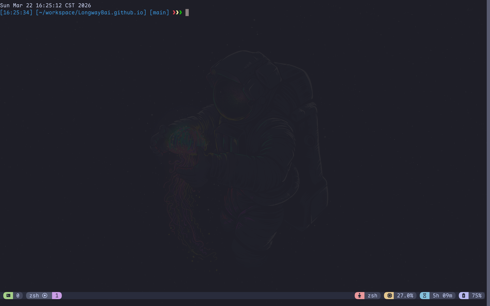
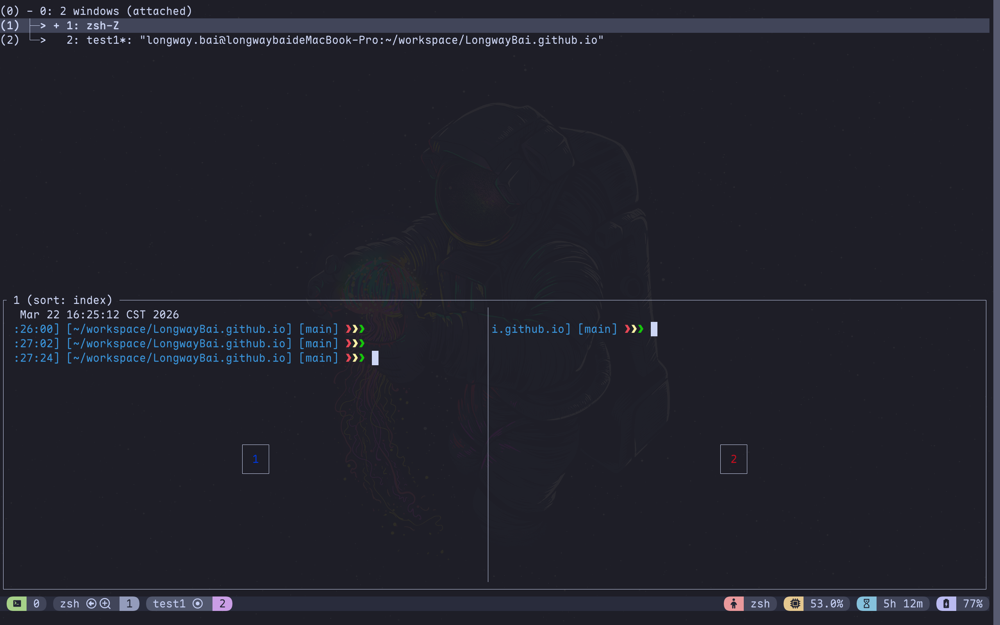
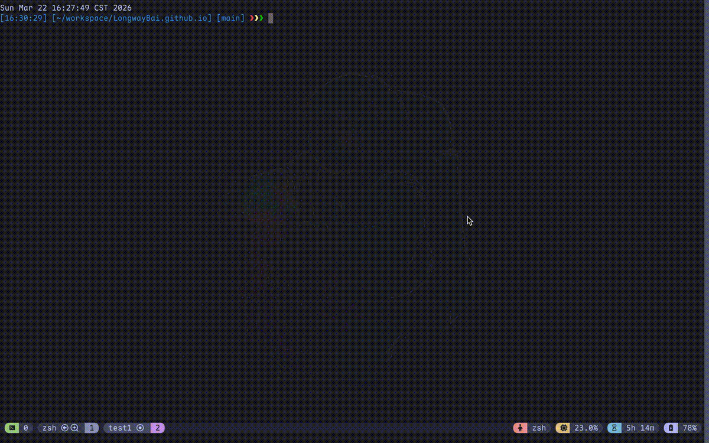
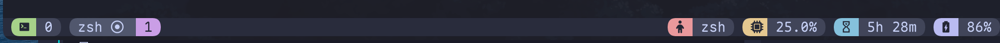

这组文档基于 [LongwayBai/tmux-config](https://github.com/LongwayBai/tmux-config) 整理，目标是把 tmux 的基础概念、安装流程和常用键位说明清楚，方便初学者快速上手，也方便后续查阅。



*图：这是我现在日常使用的 tmux 界面。分屏、状态栏、主题和插件信息都放进了同一个窗口里。*

## 你可以先看哪几页

- [安装与初始配置](/docs/tmux/installation)：适合第一次安装或迁移配置时使用
- [快捷键速查](/docs/tmux/keymaps)：适合装好之后快速查按键

如果你想先理解 tmux 的工作方式，再开始动手，继续往下看这一页即可。

## tmux 是什么

`tmux` 的全称是 **Terminal Multiplexer**，中文通常叫“终端复用器”。

这个名字听起来有点硬，但它做的事情其实很好理解：**它允许你在一个终端窗口里，管理多个终端工作区。**

你可以把 tmux 想成“终端里的工作台”。它不是只开一个 shell，而是帮你把整个命令行工作环境组织起来。tmux 最核心的价值大概有三件事：

1. 一个终端里可以同时开很多工作区。
2. 会话可以保留，断线也不怕。
3. 可以通过配置和插件，把终端打磨成一个长期可用的工作环境。

如果只用一句话来概括，那就是：**tmux 让终端从“临时命令输入框”，变成了“可以长期使用的工作空间”。**

## 它适合什么场景

tmux 最适合下面这几类场景：

- 需要长期 SSH 到服务器工作
- 希望一个终端里同时放代码、服务、日志和测试
- 想减少终端标签页切换
- 想把命令行环境整理成一个可以长期维护的工作空间

它最常见的价值主要是两件事：一是**断线后会话还能保留**，二是**把命令行布局组织得更清楚**。

## 先理解这 4 个核心概念

tmux 对新手来说，最容易卡住的地方不是命令本身，而是脑子里没有模型。你先记住下面这四个词：

- **Session（会话）**：一个完整的工作空间，比如 `blog`、`work`。
- **Window（窗口）**：session 里的标签页。
- **Pane（面板）**：window 里的分屏区域。
- **Prefix（前缀键）**：tmux 所有快捷键的入口。

这里有一个很关键的细节：tmux 默认前缀键是 `Ctrl+b`，但 **LongwayBai/tmux-config 把它改成了 `Ctrl+a`**。也就是说，安装这套配置之后，很多操作都应该是“先按 `Ctrl+a`，再按别的键”，不是默认的 `Ctrl+b`。



*图：把 tmux 想成三层结构：会话、窗口、面板；前缀键则是所有操作的统一入口。*

:::tip[先掌握最小闭环]
建议先只掌握下面几个动作，这几个会了，你其实已经能开始用了。
:::

## 先学会最小闭环

建议先只掌握下面几个动作：

### 1. 启动一个会话

```bash
tmux new -s demo
```

这里的 `demo` 是会话名，你可以随便改。

### 2. 查看当前有哪些会话

```bash
tmux ls
```

### 3. 重新连接一个会话

```bash
tmux attach -t demo
```

### 4. 从当前会话分离

默认 tmux 是 `Ctrl+b d`，但在这套配置里是：

```text
Ctrl+a d
```

这个动作叫 **detach**，意思不是退出，而是“先离开，但会话继续在后台跑”。很多新手第一次用 tmux，最容易误解的就是这里：**detach 不是 exit。**



*图：tmux 最核心的体验不是分屏，而是会话可以离开、可以回来。*

### 5. 真正关闭会话

如果你想彻底结束一个 session，可以执行：

```bash
tmux kill-session -t demo
```

或者把里面的 shell 都退出掉。只要上面这几个动作会了，你其实已经能开始用了。后续安装步骤请直接看 [安装与初始配置](/docs/tmux/installation)。

## LongwayBai/tmux-config 这套配置提供了什么

在 tmux 原生能力之上，这套配置 README 里明确提到的特性包括：

- Catppuccin Frappe 主题
- 一套更适合日常使用的按键绑定
- 鼠标支持
- OSC52 剪贴板增强
- TPM 插件管理
- `tmux-cpu`、`tmux-battery`、`tmux-floax` 等插件

## 这套配置相对默认 tmux 改了什么

这里最容易混淆的点是：**tmux 本身的能力** 和 **这份配置改出来的行为** 不是一回事。

### 1. 把前缀键从 `Ctrl+b` 改成了 `Ctrl+a`

这是最明显的变化。默认 tmux 的 `Ctrl+b` 对很多人来说不够顺手，尤其左手连按的时候不太自然。我把它改成了 `Ctrl+a`，一方面更接近一些人的肌肉记忆，另一方面也确实更容易操作。

### 2. 开启了鼠标支持

这会让初学者舒服很多。你可以直接：

- 用鼠标点击切换 pane
- 用鼠标拖动 pane 边界调整大小
- 用滚轮滚动历史内容

我个人依然建议把快捷键学起来，但在刚开始接触 tmux 的阶段，鼠标支持确实能降低门槛。

### 3. 复制模式改成了更适合 Vim 用户的风格

这套配置里，复制模式使用的是 Vi 风格。README 里列出的按键包括：

- `v`：开始选择
- `y`：复制选中的内容
- `Y`：复制整行
- `D`：复制到行尾

这里要提醒一句：**这些按键通常是在复制模式里使用的，不是平时在 shell 里直接按。** 这也是另一个很常见的新手误区。

:::warning[复制模式按键不是普通 shell 按键]
`v`、`y`、`Y`、`D` 这些键只有在进入复制模式之后才有意义。在普通 shell 提示符里按，不会出现你期待的行为。
:::

### 4. 状态栏和主题都做了增强

这套配置使用的是 **Catppuccin Frappe** 主题。除了颜色更舒服，状态栏本身也更有信息密度。按当前配置设计，状态栏会显示或尝试显示：

- 会话名称
- 当前应用和目录
- CPU 使用率
- 主机名（SSH 时）
- 运行时间
- 电池状态

所以它不是只“换了个皮肤”，而是把常用信息更自然地放到了你眼前。



*图：这套配置最直观的变化之一，就是状态栏不再只是装饰，而是一个常用信息面板。*

## 常用快捷键和安装步骤去哪里看

- 想直接安装：看 [安装与初始配置](/docs/tmux/installation)
- 想快速查按键：看 [快捷键速查](/docs/tmux/keymaps)

这样拆开之后，后续更新插件、安装方式或快捷键时，也会比维护一篇超长单页文档更轻松。

## 插件系统

这套配置使用 **TPM（Tmux Plugin Manager）** 管理插件。插件列表里比较核心的包括：

- **TPM**：插件管理器本身
- **tmux-cpu**：显示 CPU / 内存信息
- **tmux-battery**：显示电池状态
- **tmux-floax**：浮动面板支持
- **catppuccin/tmux**：主题插件

最值得记住的插件快捷键有三个：

- `Ctrl+a Shift+I`：安装插件
- `Ctrl+a Shift+U`：更新插件
- `Ctrl+a Alt+u`：卸载不再需要的插件

如果你只想记一个，那就记 `Ctrl+a Shift+I`，因为这是“插件不生效时最有可能救命”的那个键。

## 配置和美化怎么理解

tmux 不是只能黑底白字，它是可以被打磨得很顺眼、很稳定的。

### 配置文件放在哪里？

这套仓库的结构大致是这样：

```text
tmux-config/
├── tmux/
│   ├── tmux.conf
│   ├── tmux.remote.conf
│   ├── yank.sh
│   └── renew_env.sh
├── install.sh
├── README.md
├── README_EN.md
└── LICENSE
```

安装之后，核心文件会落到：

- `~/.tmux/tmux.conf`
- `~/.tmux.conf` 作为软链接指向它

这比所有内容都塞进一个 `.tmux.conf` 里更清晰一些，也方便拆分脚本。

### 主题怎么改？

README 里给出的方式是修改：

```bash
set -g @catppuccin_flavor "frappe"
```

可选值包括：

- `mocha`
- `macchiato`
- `frappe`
- `latte`

如果你想换成别的风格，比如：

```bash
set -g @catppuccin_flavor "mocha"
```

改完后重新加载配置：

```bash
tmux source ~/.tmux.conf
```

或者直接在 tmux 里按：

```text
Ctrl+a Ctrl+r
```

### 为什么美化不只是“好看”

说实话，终端美化这件事，很多人会觉得“只是好看”。但我自己长期用下来，感受是：**好看的配置不只是审美问题，也是信息组织问题。**

比如状态栏如果能清楚地展示当前会话、当前目录、系统负载、电池状态和 SSH 主机信息，那你就不用经常额外跑命令确认上下文。这其实是在减少认知负担，而不只是“让颜色更舒服”。

## 新手最容易踩的几个坑

:::danger[常见新手误区]
以下几个问题是我见过最多人踩坑的地方，务必先读一遍。
:::

### 1. `detach` 不是退出

这是第一坑。你按了：

```text
Ctrl+a d
```

tmux 并没有结束，只是把当前会话放到后台了。如果你想回来：

```bash
tmux attach -t 会话名
```

### 2. 快捷键没反应，很多时候只是前缀键按错了

默认 tmux 是 `Ctrl+b`，这套配置是 `Ctrl+a`。所以如果你看的是 tmux 官方教程，再来套这份配置，脑子里很容易打架。解决办法其实很简单：先统一接受一个事实——**这套配置里，前缀键就是 `Ctrl+a`。**

### 3. 复制模式里的按键，不是平时随便按的

比如 `v`、`y`、`Y`、`D` 这些键，通常是进入复制模式之后才有意义。如果你在普通 shell 提示符里按，自然不会出现你期待的行为。

### 4. 插件功能不是 tmux 原生能力

比如电池显示、CPU 展示、主题样式、浮动窗，这些都属于增强能力，很多是通过 TPM 插件实现的。不要把它们误认为“tmux 默认就有”。

### 5. 改了配置没生效，记得重新加载

:::tip[配置热重载]
tmux 支持不退出就重载配置，这是提高效率的好习惯。
:::

可以执行：

```bash
tmux source ~/.tmux.conf
```

或者直接按：

```text
Ctrl+a Ctrl+r
```

## 常见问题排查

### 颜色显示不对

先检查终端环境变量：

```bash
echo $TERM
```

README 里提到，常见合适的值包括：

- `xterm-256color`
- `screen-256color`
- `tmux-256color`

如果终端本身对颜色支持不够，主题效果就会打折扣。

### macOS 剪贴板不好用

README 里给出的方案是安装：

```bash
brew install reattach-to-user-namespace
```

这通常用于改善 macOS 下 tmux 与系统剪贴板的协作。

### 插件没有正常加载

可以手动执行：

```bash
~/.tmux/plugins/tpm/bin/install_plugins
```

或者重新进入 tmux 之后按：

```text
Ctrl+a Shift+I
```

## 建议的学习顺序

如果你刚开始接触 tmux，我最不建议的就是“第一天背完整快捷键表”。更实际的顺序是：

### 第一步：先会用

只学这几个动作：

- 启动会话
- 创建窗口
- 分屏
- 分离
- 重连

### 第二步：再让它顺手

开始慢慢记：

- pane 切换
- window 切换
- 复制模式
- 重新加载配置

### 第三步：最后再折腾美化和插件

:::note[关于折腾]
等你真的用起来之后，再去调整主题风格、状态栏、插件和复制体验。这样你不会被"配置细节"一开始就劝退。
:::

等你真的用起来之后，再去调整主题风格、状态栏、插件和复制体验。这样你不会被"配置细节"一开始就劝退。

## 参考仓库

- [LongwayBai/tmux-config](https://github.com/LongwayBai/tmux-config)
