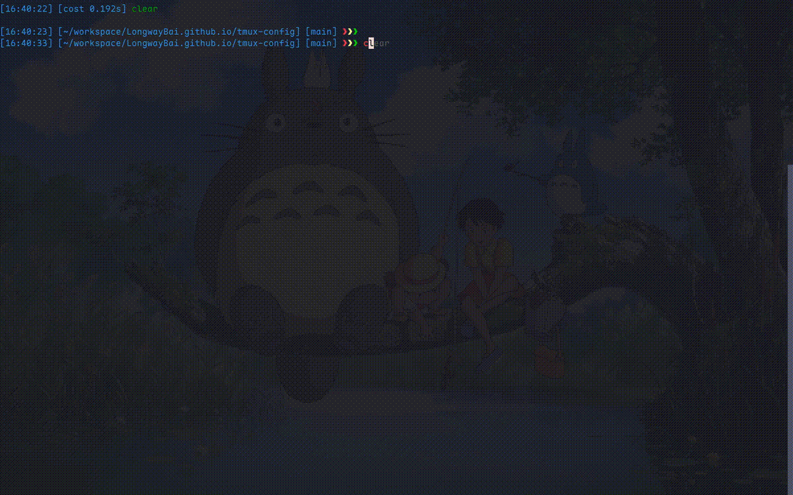

这一页单独把安装流程提出来，方便你在实际操作时对照执行。

## 1. 安装 tmux

先检查版本：

```bash
tmux -V
```

推荐版本：

- tmux 3.2+
- 更推荐 3.3

常见安装命令：

### macOS

```bash
brew install tmux
```

### Ubuntu / Debian

```bash
sudo apt update
sudo apt install tmux
```

### CentOS / Rocky / AlmaLinux

```bash
sudo yum install tmux
```

或：

```bash
sudo dnf install tmux
```

### Arch Linux

```bash
sudo pacman -S tmux
```

## 2. 安装 LongwayBai/tmux-config

```bash
git clone https://github.com/LongwayBai/tmux-config.git
cd tmux-config
./install.sh
```



*图：安装脚本会备份旧配置、复制文件，并尝试调用 TPM 安装插件。*

## 3. 安装脚本做了什么

`install.sh` 会完成或尝试完成这些动作：

1. 检查 tmux 是否已安装。
2. 自动安装 TPM（如果本机还没有）。
3. 备份 `~/.tmux.conf` 到 `~/.tmux.conf.bak`。
4. 复制仓库中的 `tmux/` 目录到 `~/.tmux/`。
5. 创建 `~/.tmux.conf -> ~/.tmux/tmux.conf` 的软链接。
6. 调用 TPM 尝试安装插件。

> 注意：这不是“临时加载”，而是会接管 tmux 主配置入口。

## 4. 手动安装方式

如果你不想执行安装脚本，也可以手动操作：

```bash
git clone https://github.com/LongwayBai/tmux-config.git
cd tmux-config

cp ~/.tmux.conf ~/.tmux.conf.bak 2>/dev/null || true
cp -a ./tmux/. ~/.tmux/
ln -sf ~/.tmux/tmux.conf ~/.tmux.conf
git clone https://github.com/tmux-plugins/tpm ~/.tmux/plugins/tpm
```

然后进入 tmux，按：

```text
Ctrl+a Shift+I
```

让 TPM 安装插件。

## 5. 常见安装问题

:::tip[遇到问题先试试这个]
插件不生效时，最有可能救命的一个快捷键：先按 `Ctrl+a Shift+I`，它会重新安装所有插件。
:::

### 主题没有生效

优先尝试：

```text
Ctrl+a Shift+I
```

### 插件没有加载

可以手动执行：

```bash
~/.tmux/plugins/tpm/bin/install_plugins
```

### macOS 剪贴板不好用

README 给出的可选方案：

```bash
brew install reattach-to-user-namespace
```
